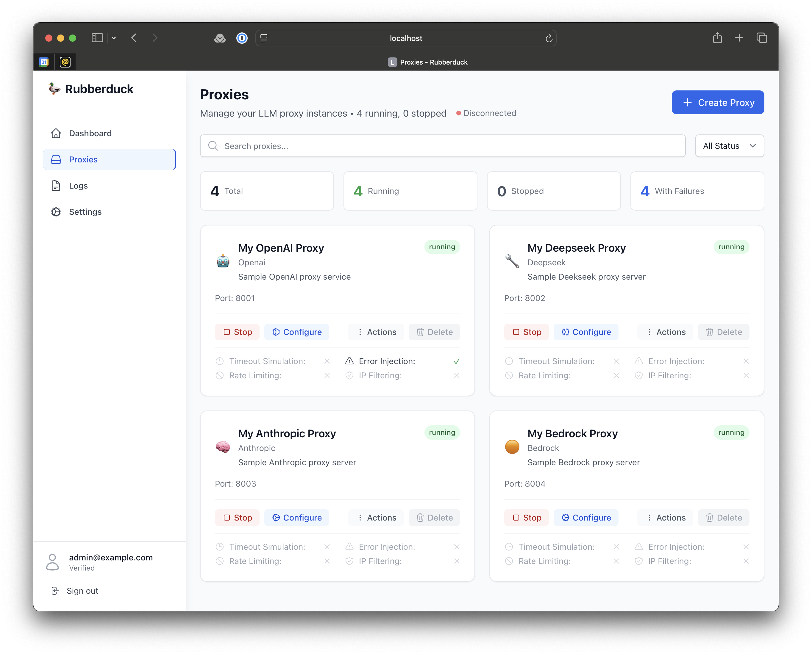

# 🦆 Rubberduck

**A local LLM caching reverse proxy server designed to emulate major LLM providers with advanced testing capabilities.**

Rubberduck provides caching, failure simulation, rate limiting, per-user proxy instances, and detailed logging for testing and development of LLM-powered applications.


## ✨ Features

### 🔄 **LLM Provider Emulation**
- Supports OpenAI, Anthropic, Azure OpenAI, AWS Bedrock, and Google Vertex AI
- Perfect request/response compatibility with official SDKs
- Transparent header and authentication passthrough

### 💾 **Intelligent Caching**
- SHA-256 cache keys based on normalized request bodies
- Only successful responses (2xx) are cached
- Manual cache invalidation per proxy instance
- Respects upstream provider caching headers

### 🧪 **Failure Simulation**
- **Timeouts**: Fixed delays or indefinite hangs
- **Error Injection**: Configurable HTTP error codes (429, 500, 400) with individual rates
- **IP Filtering**: Allow/block lists with CIDR and wildcard support
- **Rate Limiting**: Requests per minute with realistic LLM behavior

### 📊 **Comprehensive Monitoring**
- Real-time request logging with metadata
- Exportable logs (CSV/JSON)
- Rolling metrics aggregation
- Cost tracking and token usage

### 🎨 **Beautiful Web Interface**
- **Dashboard**: Live system stats and proxy monitoring
- **Proxy Management**: Full lifecycle control with visual status indicators
- **Logs**: Real-time streaming with advanced filtering
- **Settings**: Global configuration and security controls
- **Stripe-inspired UI**: Clean, modern, responsive design

### 🔐 **Authentication & Security**
- Email/password + social login (Google/GitHub)
- JWT-based authentication
- Per-user proxy isolation
- Email verification and password reset

## 📸 Screenshots



## 🚀 Quick Start

### Prerequisites

- **Python 3.11+**
- **Node.js 18+** 
- **Git**

### 1. Clone & Setup Backend

```bash
git clone https://github.com/your-username/rubberduck.git
cd rubberduck

# Create virtual environment
python -m venv venv
source venv/bin/activate  # On Windows: venv\Scripts\activate

# Install dependencies
pip install -r requirements.txt

# Initialize database
./scripts/fresh_install.sh
```

### 2. Start Backend Server

```bash
# Development server
python run.py

# Or with custom host/port
python run.py --host 0.0.0.0 --port 8000
```

The backend will be available at:
- **API**: http://localhost:9000
- **Documentation**: http://localhost:9000/docs
- **Health Check**: http://localhost:9000/healthz

### 3. Setup & Start Frontend

```bash
cd frontend

# Install dependencies
npm install

# Start development server
npm run dev
```

The frontend will be available at: http://localhost:5173

### 4. Create Your First User

1. Open http://localhost:5173 in your browser
2. Click "create a new account"
3. Register with email and password
4. Start creating LLM proxies!

## 📖 Usage

### Creating a Proxy

1. **Web Interface**: Use the "Create Proxy" button in the dashboard
2. **Configure**: Set name, provider (OpenAI/Anthropic/etc.), model name
3. **Optional**: Add description, tags, custom port
4. **Start**: Click start to begin proxy on assigned port

### Using the Proxy

Once a proxy is running, use it with any official LLM SDK by changing the base URL:

```python
# OpenAI SDK Example
import openai

client = openai.OpenAI(
    api_key="your-openai-key",
    base_url="http://localhost:8001"  # Your proxy port
)

response = client.chat.completions.create(
    model="gpt-4",
    messages=[{"role": "user", "content": "Hello!"}]
)
```

```javascript
// JavaScript SDK Example
import OpenAI from 'openai';

const openai = new OpenAI({
  apiKey: 'your-openai-key',
  baseURL: 'http://localhost:8001'  // Your proxy port
});

const response = await openai.chat.completions.create({
  model: 'gpt-4',
  messages: [{ role: 'user', content: 'Hello!' }]
});
```

### Failure Simulation

Configure failure simulation per proxy:

1. **Timeouts**: Add artificial delays to test timeout handling
2. **Error Rates**: Inject 429 (rate limit), 500 (server error), 400 (bad request)
3. **IP Filtering**: Test geographic restrictions
4. **Rate Limiting**: Simulate provider rate limits

## 🏗️ Architecture

```
┌─────────────────┐    ┌─────────────────┐    ┌─────────────────┐
│   Frontend      │    │    Backend      │    │   Database      │
│   React + TS    │◄──►│   FastAPI       │◄──►│    SQLite       │
│   Port 5173     │    │   Port 8000     │    │                 │
└─────────────────┘    └─────────────────┘    └─────────────────┘
                                │
                                ▼
                       ┌─────────────────┐
                       │ Proxy Instances │
                       │ Ports 8001+     │
                       └─────────────────┘
                                │
                                ▼
                       ┌─────────────────┐
                       │ LLM Providers   │
                       │ OpenAI, etc.    │
                       └─────────────────┘
```

### Project Structure

```
rubberduck/
├── src/rubberduck/          # Python backend
│   ├── auth/                # FastAPI Users authentication
│   ├── cache/               # Response caching system
│   ├── database/            # SQLite + SQLAlchemy
│   ├── failure/             # Failure simulation engine
│   ├── logging/             # Request logging middleware
│   ├── models/              # Database models
│   ├── providers/           # LLM provider modules
│   └── proxy/               # Reverse proxy engine
├── frontend/                # React frontend
│   ├── src/components/      # Reusable UI components
│   ├── src/pages/           # Application pages
│   ├── src/contexts/        # React contexts
│   └── src/utils/           # API client and utilities
├── tests/                   # Test suites
├── docs/                    # Documentation
└── data/                    # SQLite database files
```

## 🧪 Testing

### Backend Tests

```bash
# Run all backend tests
python -m pytest

# Run specific test categories
python -m pytest tests/unit/
python -m pytest tests/integration/

# Test with coverage
python -m pytest --cov=src/rubberduck
```

### Frontend Tests

```bash
cd frontend

# Run tests in watch mode
npm run test

# Run tests once
npm run test:run

# Run tests with UI
npm run test:ui
```

### Manual Testing

1. **Proxy Lifecycle**: Create, start, stop, configure proxies
2. **Authentication**: Register, login, logout flows
3. **Failure Simulation**: Test timeout, error injection, rate limiting
4. **Caching**: Verify cache hits/misses
5. **Logging**: Check request logging and export

## 🔧 Development

### Backend Development

```bash
# Install development dependencies
pip install -r requirements-dev.txt

# Run with auto-reload
uvicorn src.rubberduck.main:app --reload --host 0.0.0.0 --port 8000

# Format code
black src/
isort src/

# Type checking
mypy src/
```

### Frontend Development

```bash
cd frontend

# Install dependencies
npm install

# Start dev server with hot reload
npm run dev

# Lint code
npm run lint

# Build for production
npm run build
```

### Adding LLM Providers

1. Create new provider module in `src/rubberduck/providers/`
2. Implement base provider interface
3. Add to provider registry
4. Update frontend provider options

## 📊 Monitoring & Observability

### Health Check

```bash
curl http://localhost:8000/healthz
```

### Metrics

- **Proxy Status**: Running/stopped count
- **Cache Performance**: Hit rates and response times  
- **Error Rates**: Failed requests and error types
- **Cost Tracking**: Token usage and estimated costs
- **Request Volume**: RPM across all proxies

### Logs

All requests are logged with:
- Timestamp and proxy ID
- Client IP and request hash
- Response status and latency
- Cache hit/miss status
- Token usage and cost (when available)
- Failure simulation details

## 🤝 Contributing

1. Fork the repository
2. Create a feature branch: `git checkout -b feature/amazing-feature`
3. Make your changes and add tests
4. Ensure all tests pass: `npm run test && python -m pytest`
5. Commit your changes: `git commit -m 'Add amazing feature'`
6. Push to the branch: `git push origin feature/amazing-feature`
7. Open a Pull Request

### Code Style

- **Backend**: Follow PEP 8, use Black for formatting
- **Frontend**: Follow React best practices, use TypeScript strictly
- **Testing**: Write tests for all new features
- **Documentation**: Update README and code comments

## 📄 License

This project is licensed under the MIT License - see the [LICENSE](LICENSE) file for details.

## 🙏 Acknowledgments

- [FastAPI](https://fastapi.tiangolo.com/) for the excellent Python web framework
- [React](https://reactjs.org/) and [Tailwind CSS](https://tailwindcss.com/) for the frontend
- [FastAPI Users](https://fastapi-users.github.io/) for authentication
- All the amazing LLM providers that make this possible

## 📞 Support

- 📧 **Email**: support@rubberduck.dev
- 🐛 **Issues**: [GitHub Issues](https://github.com/your-username/rubberduck/issues)
- 💬 **Discussions**: [GitHub Discussions](https://github.com/your-username/rubberduck/discussions)
- 📖 **Documentation**: [Wiki](https://github.com/your-username/rubberduck/wiki)

---

<div align="center">
  <strong>Built with ❤️ for the LLM development community</strong>
</div>